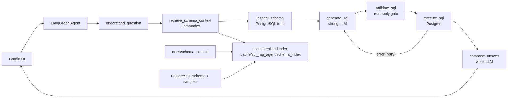

# Datathon 2026

This repository contains two related workstreams for the Datathon 2026 ecommerce dataset:

- a normalized local PostgreSQL schema built from the raw CSV data
- a SQL question-answering agent with a simple Gradio UI

The SQL agent now uses LLMs to understand questions, generate SQL, repair failed SQL, and compose grounded answers. Phase 2 adds LlamaIndex schema context retrieval so the agent can use semantic metadata, value vocabulary, join rules, and examples before SQL generation. Deterministic query patterns remain as fallback behavior for known phase-1 questions, and SQL validation still runs before any query reaches PostgreSQL.

## Quick Start: SQL Agent UI

Prerequisites:

- `uv` available on PATH
- PostgreSQL running locally
- database `datathon_2026` loaded with the `stg`, `core`, and `mart` schemas
- repo-root `.env` containing PostgreSQL and LLM connection values

Example `.env`:

```text
PGHOST=127.0.0.1
PGPORT=5432
PGDATABASE=datathon_2026
PGUSER=postgres
PGPASSWORD=your-password

SQL_AGENT_USE_LLM=true
OPENAI_API_KEY=your-api-key
OPENAI_API_BASE=https://api.openai.com/v1
SQL_AGENT_LLM_STRONG_MODEL=gpt-5.3-codex
SQL_AGENT_LLM_WEAK_MODEL=gpt-4o-mini

SQL_AGENT_SCHEMA_RETRIEVAL_ENABLED=true
SQL_AGENT_SCHEMA_INDEX_DIR=.cache/sql_rag_agent/schema_index
SQL_AGENT_SCHEMA_DOCS_DIR=docs/schema_context
SQL_AGENT_RETRIEVAL_TOP_K=8
SQL_AGENT_EMBEDDING_MODEL=text-embedding-3-small
```

`OPENAI_API_BASE` can point to any OpenAI-compatible endpoint. Strong-model settings are used for question understanding, SQL generation, and SQL repair. Weak-model settings are used for answer composition.

Create or refresh the repo-local environment:

```powershell
uv sync
```

Start or restart the UI and open it in the browser:

```powershell
.\scripts\restart_sql_rag_agent_ui.cmd
```

The UI runs at:

```text
http://127.0.0.1:7860
```

Use another port if needed:

```powershell
.\scripts\restart_sql_rag_agent_ui.cmd 7861
```

The restart script stops any existing listener on the selected port, starts `uv run python -m sql_rag_agent.ui`, waits briefly, and opens the UI URL. Server logs are written to:

```text
.tmp_sql_rag_agent_ui.out.log
.tmp_sql_rag_agent_ui.err.log
```

Agent trace logs are written to:

```text
logs/agent_traces/*.jsonl
```

Trace records include the question, selected tables, LLM SQL candidate, SQL validation result, execution result, LLM answer output, final answer, and errors. Secrets such as `PGPASSWORD` and `OPENAI_API_KEY` are not logged.

LlamaIndex schema index files are stored locally and are ignored by git:

```text
.cache/sql_rag_agent/schema_index
```

## Supported Questions

The LLM can attempt broader ecommerce questions using the selected schema context. These deterministic patterns are also supported as fallback:

- `How many customers are there?`
- `How many customers refunded in 17/7/2017 - 17/8/2017?`
- `Which product had the highest revenue last quarter?`

Unsupported prompts such as `hello` return a clear unsupported-question message instead of executing a misleading fallback query. Unsafe SQL is blocked before execution.

## SQL Agent Architecture

Source package:

```text
src/sql_rag_agent/
```

Main files:

- `ui.py`: Gradio UI with one question box and one answer box.
- `graph.py`: LangGraph controller that wires the agent nodes.
- `state.py`: shared `SQLAgentState` object passed between nodes.
- `config.py`: reads PostgreSQL settings from environment variables and repo-root `.env`.
- `llm.py`: OpenAI-compatible LLM provider used for question understanding, SQL generation, SQL repair, and answer composition.
- `retrieval/`: LlamaIndex schema context retrieval and index-building helpers.
- `tracing.py`: JSONL trace writer for agent runs.
- `tools/mcp_postgres.py`: MCP-style PostgreSQL wrapper for schema inspection and read-only query execution.
- `tools/sql_validator.py`: SQL safety checks before execution.

Phase-2 graph:



Node responsibilities:

- `understand_question.py`: classifies the question and flags broad requirements such as aggregation, joins, and date filters.
- `retrieve_schema_context.py`: retrieves semantic table descriptions, value vocabulary, business rules, join rules, and caveats using LlamaIndex.
- `inspect_schema.py`: selects relevant tables using the question and retrieved semantic context, then fetches confirmed schema metadata through the PostgreSQL wrapper.
- `generate_sql.py`: asks the strong LLM for one SQL candidate using both semantic context and confirmed PostgreSQL schema, then falls back to deterministic patterns when needed.
- `validate_sql.py`: rejects unsafe SQL and unsupported query shapes before execution.
- `execute_sql.py`: executes only validated SQL through PostgreSQL and lets the strong LLM repair execution errors up to three times.
- `compose_answer.py`: asks the weak LLM to compose a grounded answer from result rows, then falls back to a deterministic answer if the LLM is unavailable.

The table dropdown is a hard scope boundary. If tables are selected in the UI, retrieval, schema inspection, and SQL generation only receive context for those selected tables.

## PostgreSQL Architecture

The database is split into three schemas:

- `stg`: raw landing tables close to CSV shape for auditability and reloads.
- `core`: normalized relational model for joins and analytics.
- `mart`: reporting-friendly aggregate tables.

Important SQL setup files:

```text
sql/01_create_schemas_and_staging.sql
sql/02_create_core_tables.sql
sql/03_transform_staging_to_core.sql
sql/04_create_marts.sql
sql/05_verify_schema.sql
scripts/setup_postgres_local.ps1
```

More detail:

```text
docs/postgres-local-setup.md
docs/schema-postgres-import-report.md
docs/Pipeline plan.md
```

## Load or Rebuild PostgreSQL

The setup runner expects raw CSV files in:

```text
data/raw
```

Run the loader:

```powershell
powershell -ExecutionPolicy Bypass -File .\scripts\setup_postgres_local.ps1
```

If your PostgreSQL service requires a password, either put `PGPASSWORD` in `.env` for the Python agent or set it in the shell for the PowerShell loader:

```powershell
$env:PGPASSWORD = 'your-password'
powershell -ExecutionPolicy Bypass -File .\scripts\setup_postgres_local.ps1
```

## Tests

Run the current agent and data-quality tests:

```powershell
uv run python -m pytest tests/test_sql_rag_agent_phase1.py tests/test_data_quality_pipeline.py -q
```

The SQL agent tests use a fake PostgreSQL tool for graph behavior and do not require a live database. Direct UI and manual question-answer checks do require the local PostgreSQL service.

## Current Limitations

- Only one SQL candidate is generated.
- The UI intentionally has no trace/log panel.
- Trace logs are file-based JSONL only.
- The local LlamaIndex cache is rebuilt automatically when missing, but there is no dedicated cache invalidation UI yet.

These are planned later phases in `docs/Pipeline plan.md`.
